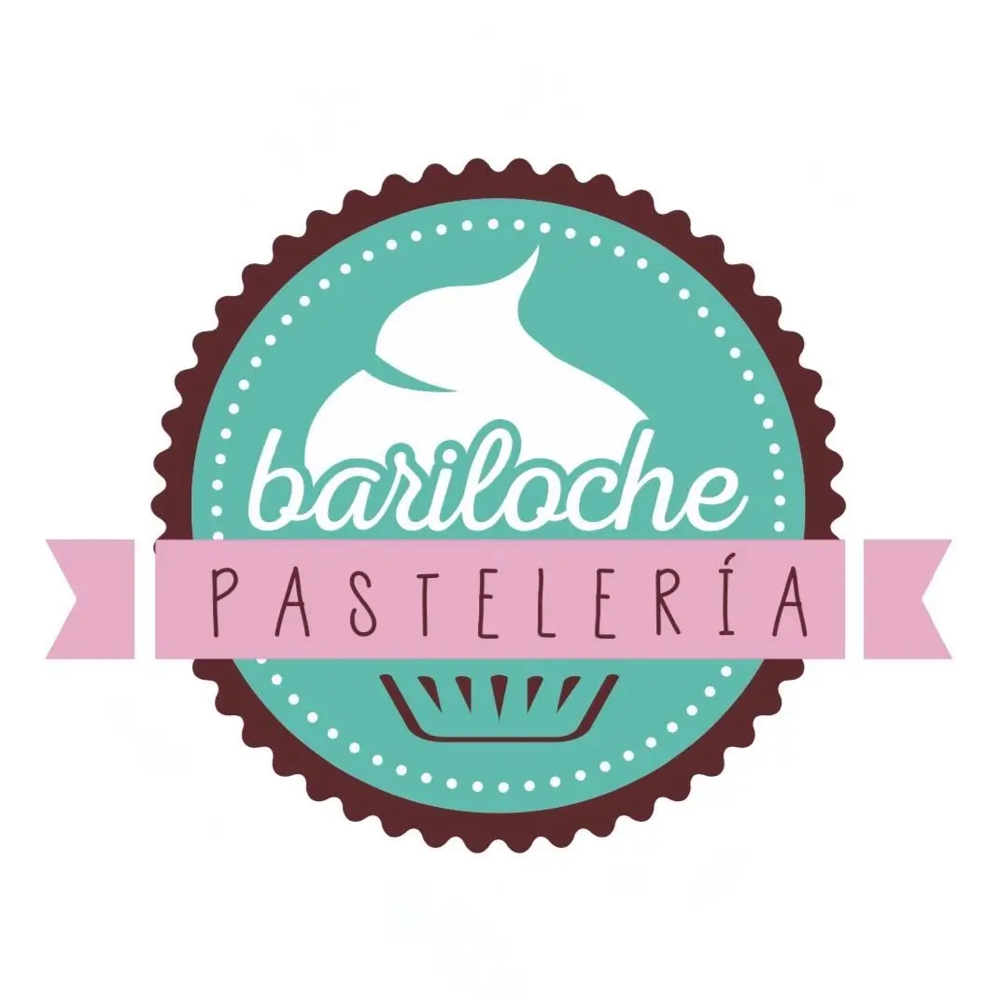

#   COLORES
## ¿Qué colores has elegido?

    Los colores que he elegido son:

- Blanco: #fff

- Verde agua: #61b9ad

- Rosa pastel: #e9aec4

- Marrón: #5d302d

## ¿Porqué has elegido esos colores?
    -Los colores no tienen ningun significado especial, alomejor como son colores pasteles dan la impresión de ser una pasteleria o algun sitio  "dulce".

    -El verdadero motivo de porque he elegido esos colores es por que el logo del bar los tiene.

    Además en el propio bar ves los colores en las mesas, las sillas, las paredes, etcetera.

### Imágen del logo del bar
